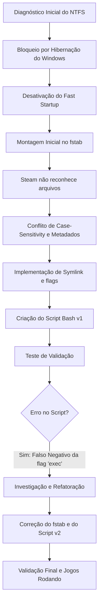

# 🐧 Troubleshooting e Automação: Steam Linux (Proton) com Jogos em Partição NTFS

## 📌 Objetivo
Documentar o procedimento técnico de diagnóstico e resolução de conflitos ao tentar executar jogos nativos do Windows no Linux (via Proton/Steam Play) utilizando uma partição NTFS compartilhada. Este documento serve como base de conhecimento, detalhando não apenas a solução final, mas o **processo iterativo de desenvolvimento e troubleshooting**, registrando os erros encontrados e as lições aprendidas.

## 🖥️ Ambiente / Hardware
* **Sistema de Arquivos Alvo:** NTFS
* **Cenário:** Dual Boot (Windows + Linux)
* **Partição de Jogos:** `/dev/sda2`
* **Camada de Compatibilidade:** Steam Play / Proton

## 🐧 Sistema Operacional
* **Kernel Linux:** 7.0.0-29-generic
* **Driver NTFS Utilizado:** `ntfs3` (Nativo do Kernel 5.15+)

---

## 🔄 Evolução do Projeto (Desenvolvimento Iterativo)

Este projeto não nasceu pronto. Ele foi desenvolvido através de ciclos de **análise, implementação, teste e refatoração**, refletindo práticas reais de Engenharia de Software e DevOps para resolução de incidentes.



## 🐛 Problemas Encontrados Durante o Desenvolvimento

| Problema | Causa Técnica | Como Identificamos | Correção | Status |
| :--- | :--- | :--- | :--- | :--- |
| Partição em "Somente Leitura" | Windows hibernado (`hiberfil.sys`) ativando proteção "dirty bit" no NTFS. | Comando `ls -la` listou o arquivo; falha ao criar `.txt` no Linux. | Comando `powercfg.exe /hibernate off` executado no CMD do Windows. | ✅ Resolvido |
| Steam listando "0 itens" | Conflito de metadados antigos e isolamento de caminhos do Windows (`Program Files`). | A Steam mapeava o espaço total, mas não lia os arquivos `.acf` (manifestos). | Deleção do cache antigo e criação de *Link Simbólico* (`ln -s`) direto para a pasta. | ✅ Resolvido |
| Falso Negativo de Permissão (`noexec`) no Script Bash v1 | A flag `user` no `fstab` sobrepõe regras de execução (injetando `noexec`). O comando `findmnt` oculta `exec` (por ser padrão), mas exibe `noexec`. O script procurava a string errada. | O script apontava falha (Vermelho), mas a partição já permitia leitura/escrita. Os jogos não rodavam. | 1. Remoção da flag `user` do `/etc/fstab`. 2. Alteração na lógica do Bash de `== *"exec"*` para `!= *"noexec"*`. | ✅ Resolvido |
| `mount -a` bloqueado pelo sistema | Modificação manual do `fstab` sem notificar o gerenciador de serviços do Linux. | O terminal retornou: *"systemd still uses the old version"*. | Execução do comando `sudo systemctl daemon-reload` antes do `mount`. | ✅ Resolvido |

---

## 🛠️ Procedimento Detalhado de Resolução

### 🔴 O Problema Inicial
A Steam no Linux não reconhecia a biblioteca de jogos instalada na partição NTFS do Windows. A interface classificava o espaço como "NON-STEAM". Quando um jogo tentava abrir, abortava silenciosamente.

### 🔎 A Investigação
O sintoma clássico de botão "Jogar -> Rodando -> Jogar" indica falta de permissões de execução (POSIX) na partição de disco.
1. O teste de permissão `ls -la /mnt/jogos_steam` revelou o arquivo `hiberfil.sys`.
2. Concluiu-se que o NTFS estava travado em modo leitura por segurança do Kernel (Fast Startup do Windows).

### ⚙️ A Correção (Passo a Passo)

**1. Liberação do Sistema de Arquivos (No Windows)**
* Boot no Windows. Abertura do CMD (Administrador).
* Execução: `powercfg.exe /hibernate off`
* Reinício limpo (sem clicar em "Desligar").

**2. Configuração de Montagem Segura e Case-Sensitivity (No Linux)**
Foi mapeado o UUID (`blkid | grep ntfs`) e inserido no arquivo `/etc/fstab`.
* A linha adotada utilizou o driver de alta performance `ntfs3`.
* Foram adicionadas as credenciais (`uid`, `gid`) e a permissão irrestrita (`umask=000`).
* As flags `iocharset=utf8` e `nocase` foram injetadas para que a Steam ignorasse diferenças entre maiúsculas/minúsculas vindas do Windows.

**3. Isolamento por Symlink (Link Simbólico)**
Para evitar corromper a estrutura do Windows, a biblioteca foi isolada virtualmente no Linux:
```bash
# Limpeza do mapeamento problemático
rm -rf /mnt/jogos_steam/SteamLibrary
mkdir -p /mnt/jogos_steam/SteamLibrary

# Link absoluto para os binários reais
ln -sf "/mnt/jogos_steam/Program Files (x86)/Steam/steamapps" /mnt/jogos_steam/SteamLibrary/steamapps
```

**4. O Incidente da Flag `user` vs `exec` (A Evolução da Solução)**
Na primeira versão da montagem no `fstab`, inserimos a flag `user` (para facilitar o uso sem root).
* **O Erro:** O Kernel injeta silenciosamente o bloqueio `noexec` quando a flag `user` é declarada, anulando o comando `exec` colocado posteriormente. O Proton foi bloqueado.
* **A Refatoração:** A flag `user` foi removida. A linha final e funcional no `/etc/fstab` tornou-se:
  ```text
  UUID=SEU_UUID /mnt/jogos_steam ntfs3 uid=1000,gid=1000,rw,exec,umask=000,iocharset=utf8,nocase 0 0
  ```

---

## 📜 Automação: Entendendo o Script Atual (`check_steam_ntfs.sh`)

Para garantir a estabilidade a longo prazo, foi desenvolvido um script de auditoria em Bash. Ele reflete a versão final do nosso aprendizado.

### Como o Código Pensa (Versão Atual)
1. **Validação de Dependências:** Não assume que a ferramenta de diagnóstico existe (verifica o `findmnt`).
2. **Auditoria de Ponto de Montagem:** Verifica se a montagem existe antes de checar as permissões.
3. **Análise de Driver:** Confirma se o sistema optou pelo `ntfs3` ou o `ntfs-3g`.
4. **Tratamento de Restrições (Correção da v1):** Não procura ativamente pela flag `exec`. Em vez disso, verifica a **ausência** da restrição de segurança (`noexec`). Resolve o falso negativo.
5. **Auditoria de Fast Startup:** Procura fisicamente pelo `hiberfil.sys`.
6. **I/O Físico:** Realiza um teste real de `touch` na partição (ação > configuração teórica).
7. **Validação de Symlink:** Checa se o atalho para a biblioteca da Steam no Windows não está quebrado.

### O Código (Trechos Críticos)

```bash
# ANTES (v1 - Gerava falso negativo no Linux):
if [[ "$MOUNT_OPTIONS" == *"exec"* ]]; then
    # Sucesso

# DEPOIS (v2 - Reflete o comportamento padrão do util-linux):
# Por que mudamos isso? A permissão de execução é padrão, a flag só aparece se for negada ("noexec").
if [[ "$MOUNT_OPTIONS" != *"noexec"* ]]; then
    echo -e "   [OK] Permissão de execução ativada (sem bloqueios noexec)"
```

---


## 🎓 Lições Aprendidas

1. **A Ordem das Flags Importa:** A flag `user` no `/etc/fstab` ativa proteções de segurança silenciosas (`noexec`, `nosuid`). Em servidores ou partições fixas de jogos, isso deve ser evitado.
2. **Cuidado com Falsos Negativos (Parsing de Comando):** Procurar a existência de uma palavra (`exec`) no terminal é perigoso. O utilitário `findmnt` esconde o que é "padrão". A abordagem correta em Bash é buscar a **negação** de um estado (verificar se `noexec` **não** existe).
3. **O Daemon do Systemd é Soberano:** O arquivo `/etc/fstab` é apenas um texto. O SO opera baseado no cache de memória do `systemd`. Nunca ignore o aviso para rodar `systemctl daemon-reload` após uma edição manual.
4. **Metadados (Case-Sensitivity):** O driver Linux lida estritamente com arquivos (`Steam` ≠ `steam`). Sem a flag `nocase`, a compatibilidade com estruturas herdadas da Microsoft quebra rapidamente.

## ⚠️ Possíveis Problemas

* **Erro:** A partição volta a ficar Read-Only (Somente leitura).
  * **Causa:** O Windows foi iniciado e desligado novamente.
  * **Solução:** O Windows deve ser sempre *Reiniciado* quando for trocar para o Linux, ou a atualização do Windows reativou a Hibernação. Refaça o comando `powercfg.exe`.
* **Erro:** Kernel Panic no boot.
  * **Causa:** Erro de digitação no `/etc/fstab`.
  * **Solução:** Acesse o modo de recuperação (Emergency Mode), abra o `/etc/fstab` com o `nano` e corrija/comente a linha. Sempre rode `sudo mount -a` antes de reiniciar.

## 🔐 Considerações de Segurança
* O parâmetro `umask=000` concede permissão 777 (irrestrita) ao ponto de montagem NTFS. Isso é exigido pela camada Proton. Em um ambiente corporativo, evite colocar arquivos sensíveis nesta partição, pois qualquer script em espaço de usuário poderá modificá-los.
* Não exponha esse disco em serviços de rede sem ajustar regras de ACL (ex: Samba), pois o NTFS montado no Linux bypassará permissões finas nativas.


## ✅ Execução e Validação
Para auditar a saúde da partição e do Proton:
```bash
./check_steam_ntfs.sh
```
Na Steam (Linux), adicione a unidade apontando para a nova pasta com symlink: `/mnt/jogos_steam/SteamLibrary`. 


## 📚 Referências
* [Proton GitHub - Required ext4/NTFS parameters](https://github.com/ValveSoftware/Proton/wiki/Using-a-NTFS-disk-with-Linux-and-Windows)
* Documentação oficial Kernel Linux (Driver ntfs3).