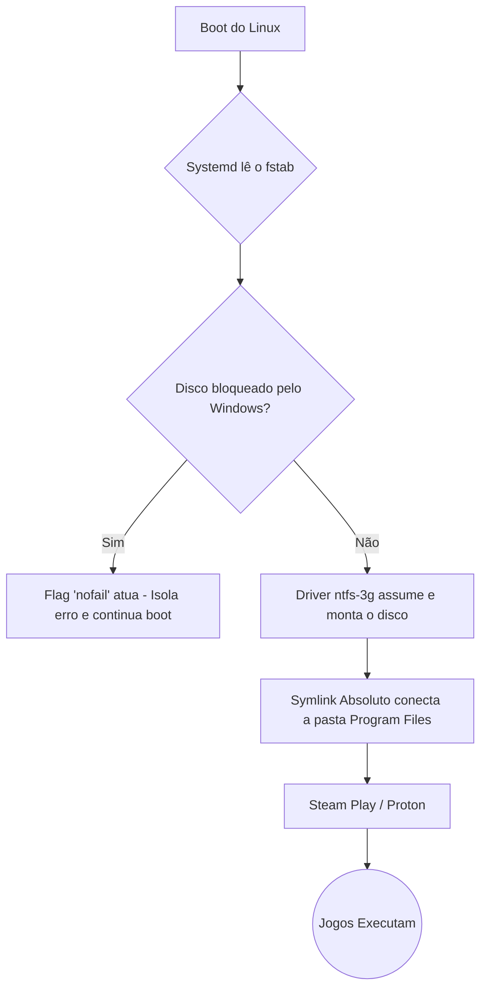

# 🐧 Troubleshooting e Automação: Steam Play (Proton) em Partição NTFS

## 📌 Objetivo
Documentar o processo completo de diagnóstico, implementação, falhas críticas (Emergency Mode) e refatoração para permitir a execução de jogos nativos do Windows no Linux (via Proton/Steam Play) a partir de uma partição NTFS. 

Este repositório serve como um **registro técnico vivo**. Ele documenta o ciclo de desenvolvimento iterativo, as peculiaridades do Kernel Linux (falsos positivos, *Emergency Mode*, automount), o comportamento estrito de drivers NTFS nativos e as lições aprendidas em infraestrutura.

## 🖥️ Ambiente / Hardware
* **Sistema de Arquivos:** NTFS
* **Cenário:** Dual Boot (Windows + Ubuntu/Debian-based)
* **Partição Alvo:** `/dev/sda2`
* **Camada de Compatibilidade:** Steam Play / Proton
* **Kernel Linux:** 7.0.0-29-generic
* **Driver NTFS Final:** `ntfs-3g` (Substituindo o problemático `ntfs3` nativo)

---

## 🔁 Desenvolvimento Iterativo

A construção desta solução seguiu um ciclo real de Engenharia de Infraestrutura e DevOps.
**Requisito ➔ Implementação ➔ Teste ➔ Falha Crítica ➔ Debugging (Emergency Mode / dmesg) ➔ Refatoração ➔ Validação.**

A implementação inicial lidou com bloqueios do Windows, mas falhou ao não prever a fragilidade do driver nativo do Linux perante o Dual Boot, causando travamentos no nível do sistema operacional. O problema exigiu auditoria de logs do Kernel (`dmesg`) para identificar a incompatibilidade técnica e aplicar uma solução estável de mercado (`ntfs-3g`).

---

## 🔄 Evolução do Projeto (A Linha do Tempo)

```text
v1.0 (A Configuração Inicial)
│
├── Mapeamento NTFS e Script de Auditoria.
│
▼
Teste de Auditoria
│
├── 🐛 Erro: Falso negativo na flag 'exec' no script Bash.
│
▼
v1.1 (Correção de Lógica)
│
├── 🛠️ Correção: Script alterado para buscar *ausência* de 'noexec'.
├── 🛠️ Correção: Remoção da flag 'user' do fstab.
│
▼
Teste de Boot (Reboot Real)
│
├── 🚨 FALHA CRÍTICA: Linux entra em "Emergency Mode".
│
▼
Investigação de Nível 1 (Emergency Mode)
│
├── 🧠 Causa: O Windows sujou o disco (Dirty Bit). O Linux tentou montar o disco obrigatório no boot, falhou e parou o sistema inteiro.
│
▼
v1.2 (Resiliência)
│
├── 🛠️ Correção: Inclusão da flag 'nofail' no fstab. (Sistema volta a dar boot).
│
▼
Teste de Montagem de Disco (mount -a)
│
├── 🐛 Erro: "volume is dirty and force flag is not set" (Recusa de montagem).
│
▼
Investigação de Nível 2 (Logs do Kernel - dmesg)
│
├── 🧠 Causa Técnica: O driver nativo `ntfs3` exige que o Windows rode 'chkdsk' e é intolerante a pequenos updates do Windows.
│
▼
v1.3 (Troca de Arquitetura e Cache)
│
├── 🛠️ Correção: Troca do driver `ntfs3` para `ntfs-3g`.
├── 🛠️ Correção: Erro de digitação humano (notail -> nofail) consertado.
├── 🛠️ Correção: Limpeza do cache do Systemd (`daemon-reload`).
│
▼
Teste Final de Validação
│
├── 🐛 Erro secundário: Ícone de Symlink quebrado com "X" vermelho.
├── 🧠 Causa: Ao remover o ntfs3, removemos o 'nocase'. O Linux cobrou o Case-Sensitivity exato do Windows.
├── 🛠️ Correção Final: Deleção do atalho morto e recriação forçada do Symlink (`ln -sf`).
│
▼
✅ Estado Atual: Partição funcional, montando em boot e jogos rodando.
```

---

## 🐛 Problemas Encontrados Durante o Desenvolvimento

| Problema | Origem | Como identificamos | Correção | Status |
| :--- | :--- | :--- | :--- | :--- |
| Emergency Mode (Kernel Panic) | **Ambiente** (Falta de resiliência) | Após reiniciar o PC, o Linux parou na tela preta de terminal exigindo manutenção root. | Adicionada a flag `nofail` no `/etc/fstab` pelo modo root. | ✅ Resolvido |
| Erro `No such device` / `volume is dirty` | **Driver Intolerante** (`ntfs3`) | Comando `sudo dmesg \| grep ntfs` revelou o Kernel rejeitando a montagem exigindo `chkdsk`. | Substituição do driver nativo `ntfs3` pelo driver `ntfs-3g` no `fstab`. | ✅ Resolvido |
| Falso negativo da permissão `exec` | **Código** (Premissa incorreta) | O script alertava falha na permissão, mas I/O funcionava. | Lógica alterada de `== *"exec"*` para `!= *"noexec"*`. | ✅ Resolvido |
| Symlink com ícone de Erro (X Vermelho) | **Case-Sensitivity** | A interface gráfica não abria o atalho; o script acusava 'Broken Link'. | Apagamento da pasta via `rm` e recriação usando autocompletar (`TAB`). | ✅ Resolvido |
| Erro ao remontar o fstab | **Comando inadequado** | Erro: *"systemd still uses the old version"*. | Execução de `systemctl daemon-reload` antes do `mount`. | ✅ Resolvido |

---

## 🧠 Análise das Correções Críticas (Por que mudamos?)

### 🚨 Correção 1: O Incidente do Emergency Mode
* 🔴 **Problema:** O computador parou de dar boot no Ubuntu, parando na tela preta.
* 🔎 **Investigação:** Como adicionamos um disco secundário obrigatório no `fstab` sem tolerância a falhas, quando o Windows o bloqueou, o Kernel abortou a inicialização.
* 🧠 **Causa (Técnica):** Por padrão, qualquer linha no `fstab` é tratada como "missão crítica" pelo Systemd.
* 🛠️ **Correção:** Inserção da flag `nofail`. 
* 📚 **Lição:** Em servidores ou desktops, discos de jogos/dados nunca devem impedir o boot do SO principal. O `nofail` isola o erro.

### 🚨 Correção 2: A Migração do Driver `ntfs3` para `ntfs-3g`
* 🔴 **Problema:** Mesmo com o `nofail` salvando o boot, a montagem manual (`mount -a`) retornava erro `No such device`.
* 🔎 **Investigação:** Lemos o log profundo do Kernel através do `dmesg`. O sistema acusava: `volume is dirty and "force" flag is not set! It is recommended to use chkdsk`.
* 🧠 **Causa (Técnica):** O driver `ntfs3` (incorporado recentemente ao Kernel) é incrivelmente rápido, porém extremamente rigoroso com a MFT (Master File Table). Qualquer micro-update do Windows em background marca o disco como "sujo". Ele se recusa a montar para proteger os dados.
* 🛠️ **Correção:** Voltamos para o driver clássico `ntfs-3g` (baseado em FUSE).
* 📚 **Lição:** Desempenho (ntfs3) vs Estabilidade (ntfs-3g). Em um ambiente de Dual Boot agressivo, a resiliência do `ntfs-3g` ganha, evitando a necessidade de reparar o disco no Windows toda semana.

### 🚨 Correção 3: Case-Sensitivity e Symlink Quebrado
* 🔴 **Problema:** Após consertar o disco, o atalho dos jogos apareceu com um X vermelho.
* 🧠 **Causa:** O driver `ntfs3` permitia a flag `nocase` (ignorando maiúsculas e minúsculas). O `ntfs-3g` lida com o Linux de forma nativa (Case-Sensitive). O link antigo perdeu a sincronia exata do nome da pasta (`Steamapps` vs `steamapps`).
* 🛠️ **Correção:** Deleção do atalho e refatoração usando o autocompletar do terminal (`TAB`) para puxar o nome exato.

---

## 🏗️ Arquitetura Final (Estado da Arte)



---

## 💻 Código Atual: O Script de Auditoria (v1.3)

O script `check_steam_ntfs.sh` audita o ambiente sem quebrá-lo.

1. **Validação de Driver:** Modificado para aceitar o `ntfs-3g` como o padrão ouro da estabilidade após o incidente de log.
2. **Análise de Restrição (Exec):** Verifica se não há o bloqueio explícito `noexec`. Resolve falsos negativos.
3. **Validação Física do Windows:** Detecta `/hiberfil.sys`.
4. **Symlink Dinâmico:** Checa se o destino do link (`steamapps`) existe no momento exato do teste, prevenindo o erro do "X Vermelho".

```bash
# Trecho Crítico Refatorado (Evitando Falso Negativo de Execução):
if [[ "$MOUNT_OPTIONS" != *"noexec"* ]]; then
    echo -e "   [OK] Permissão de execução ativada (sem bloqueios noexec)"
```

---

## 🎓 Lições Finais Adquiridas

1. **O `dmesg` é a Fonte da Verdade:** Quando comandos normais como o `mount` falham silenciosamente ou com mensagens vagas (ex: `No such device`), o log do Kernel (`dmesg`) dirá exatamente qual pacote/driver abortou a operação e por quê.
2. **Infraestrutura exige Tolerância a Falhas:** Modificar arquivos base (`fstab`) sem gerenciar riscos (`nofail`) resulta em perda total de acesso (Emergency Mode). Sempre isole componentes não críticos.
3. **Systemd é Soberano:** Erros de digitação humanos (`notail` em vez de `nofail`) podem gerar serviços fantasmas na memória (`autofs fuseblk`). Desmontar a unidade, recarregar o daemon (`systemctl daemon-reload`) e limpar a memória é necessário.
4. **Ferramentas Mentem (Ocasionalmente):** A linha de comando `findmnt` assume que você conhece as convenções do Linux (ocultar flags default). Se basear em regex cego (`*exec*`) gera dívida técnica.

---
**Autor:** Equipe de Infraestrutura e Automação | **Versão:** 1.3 | **Status:** ✅ Homologado