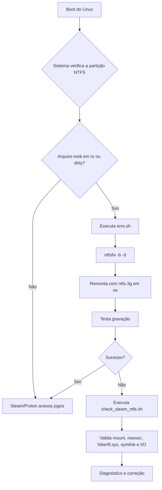

# 🐧 Troubleshooting e Automação: Steam Play (Proton) em Partição NTFS

## 📌 Objetivo

Documentar a correção e a verificação da partição NTFS usada pela Steam/Proton em ambiente de dual boot, com foco em:

- detectar se a unidade está montada em modo leitura/escrita ou somente leitura;
- validar a integridade da montagem da partição `/mnt/jogos_steam`;
- reparar dirty bit e flags NTFS quando o Windows deixa o disco em estado inconsistente;
- confirmar se a Steam Library e o Proton podem operar corretamente.

Este repositório reúne os dois principais scripts usados para esse processo: `erro.sh` e `check_steam_ntfs.sh`.

## 🖥️ Ambiente

- Sistema de arquivos: NTFS
- Cenário: Dual Boot (Windows + Linux)
- Partição alvo: `/dev/sda2`
- Ponto de montagem: `/mnt/jogos_steam`
- Compatibilidade: Steam Play / Proton
- Driver final recomendado: `ntfs-3g`

---

## 🧩 Scripts no repositório

### 1) `erro.sh`

#### Objetivo

Corrigir a partição quando ela fica em modo somente leitura (`ro`) ou com flags de Dirty Bit após o Windows ser encerrado sem fechamento limpo.

#### O que o script faz

1. desmonta `/mnt/jogos_steam` se a unidade estiver montada;
2. executa `ntfsfix -b -d /dev/sda2` para limpar flags NTFS inconsistentes;
3. monta a partição em modo de escrita com `ntfs-3g`;
4. realiza teste de gravação usando `touch` e `rm` para validar I/O.

#### Como executar

```bash
chmod +x erro.sh
sudo ./erro.sh
```

#### Exemplo real do script

```bash
# 1. Desmonta a partição caso tenha montado em 'ro'
sudo umount /mnt/jogos_steam

# 2. Limpa o dirty bit e reseta os sinalizadores NTFS
sudo ntfsfix -b -d /dev/sda2

# 3. Remonta com permissões totais de leitura, escrita e execução
sudo mount -t ntfs-3g -o rw,uid=$(id -u),gid=$(id -g),umask=000,exec /dev/sda2 /mnt/jogos_steam

# 4. Testa a gravação (não deve retornar nenhum erro)
touch /mnt/jogos_steam/teste_rw.tmp && rm /mnt/jogos_steam/teste_rw.tmp
```

---

### 2) `check_steam_ntfs.sh`

#### Objetivo

Realizar uma auditoria do ambiente Steam/Proton em NTFS antes de iniciar jogos, identificando problemas como:

- unidade não montada;
- montado em modo somente leitura;
- driver incompatível;
- flag `noexec` bloqueando execução;
- presença de `hiberfil.sys` (Windows em hibernation/fast startup);
- falha real de escrita;
- symlink quebrado da Steam Library.

#### O que ele valida

1. se o ponto de montagem existe e está montado;
2. o tipo de sistema de arquivos (`ntfs3`, `fuseblk`, etc.);
3. se a montagem está em `rw`;
4. se há bloqueio de execução por `noexec`;
5. se o Windows deixou arquivos de hibernação ativos;
6. se a gravação real funciona;
7. se o symlink da Steam Library aponta para um destino válido.

#### Como executar

```bash
chmod +x check_steam_ntfs.sh
./check_steam_ntfs.sh
```

Também é possível passar o diretório diretamente:

```bash
./check_steam_ntfs.sh /mnt/jogos_steam
```

#### Trecho crítico do diagnóstico

```bash
if [[ "$MOUNT_OPTIONS" != *"noexec"* ]]; then
    echo -e "   [OK] Permissão de execução ativada (sem bloqueios noexec)"
fi
```

---

## 🔄 Fluxograma



---

## 🧪 Resultado esperado

Quando a correção foi aplicada corretamente, o ambiente deve apresentar:

- partição montada em `/mnt/jogos_steam`;
- sistema de arquivos em modo de escrita;
- ausência de bloqueios de execução;
- teste de gravação concluído sem erro;
- Steam/Proton com acesso aos jogos em NTFS.

---

## 🧠 Lições aprendidas

1. O comando `mount` e o diagnóstico visual nem sempre explicam a causa real do problema; o log do kernel e o `dmesg` ajudam a identificar a falha técnica.
2. Um disco NTFS compartilhado entre Windows e Linux precisa ser tratado com tolerância a falhas para evitar bloqueio no boot.
3. O script `erro.sh` resolve o cenário de recuperação operacional, enquanto o `check_steam_ntfs.sh` ajuda a diagnosticar antes de tentar jogar.
4. A validação real de gravação e o symlink da Steam Library são essenciais para garantir que o Proton vai funcionar em seu ambiente.

---

**Autor:** Tiago de Aquino Nunes  
**Versão:** 1.5  
**Status:** ✅ Documentação alinhada com os scripts reais